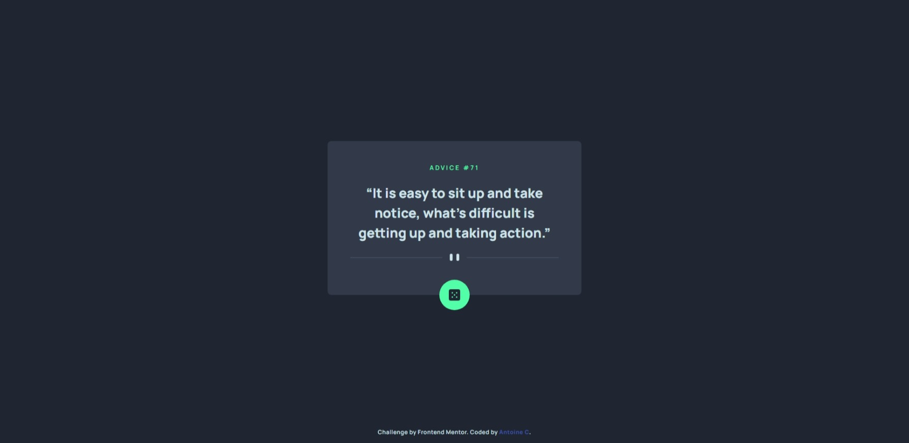
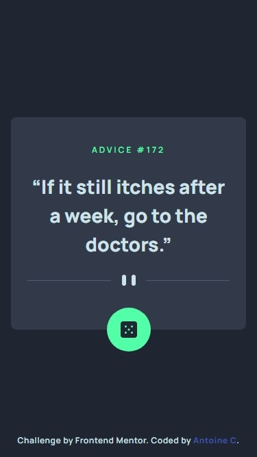

# Frontend Mentor - Advice generator app solution

This is a solution to the [Advice generator app challenge on Frontend Mentor](https://www.frontendmentor.io/challenges/advice-generator-app-QdUG-13db).

## Table of contents

- [Overview](#overview)
  - [The challenge](#the-challenge)
  - [Screenshot](#screenshot)
  - [Links](#links)
- [My process](#my-process)
  - [Built with](#built-with)
  - [What I learned](#what-i-learned)
  - [Continued development](#continued-development)
  - [Useful resources](#useful-resources)
- [Author](#author)

## Overview

### The challenge

Users should be able to:

- View the optimal layout for the app depending on their device's screen size
- See hover states for all interactive elements on the page
- Generate a new piece of advice by clicking the dice icon

### Screenshot





### Links

- Solution URL: [See solution here](https://www.frontendmentor.io/solutions/simpleui-and-api-to-get-good-advices-built-w-sveltekit-and-tailwindcss-MxUPxBFoIR)
- Live Site URL: [See live site here](https://advice-generator-app-brown.vercel.app)

## My process

### Built with

- Semantic HTML5 markup
- Flexbox
- [SvelteKit](https://kit.svelte.dev/) - JS framework
- [TailwindCss](https://tailwindcss.com/) - Utility-first CSS framework
- [Typescript](https://www.typescriptlang.org/) - Strongly typed JS

### What I learned

Make dynamic custom utilities with tailwindcss so you can use your theme properties when calling the utility in your HTML.
Exemple: "shadow-glow-green"

```js
  plugins: [
    plugin(({ matchUtilities, theme }) => {
      matchUtilities(
        {
          "shadow-glow": (value) => {
            return {
              boxShadow: `0px 0px 35px 0px ${value}`,
            };
          },
        },
        {
          values: theme("colors"),
        }
      );
    }),
  ],
```

### Continued development

[1] I would like to find a way to prevent "jumps" from happening when the next advice is way shorter/longer than the previous one.

[2] Also i will come back to this project to handle the API potential errors (try/catch) and add a toast for displaying the message.

### Useful resources

- [HTML Entities used in typography](https://www.w3.org/wiki/Common_HTML_entities_used_for_typography) - You almost got me frontend mentor with those fancy double quotes.
- [Svelte routing docs](https://kit.svelte.dev/docs/routing) - If you want to learn about the magic of Sveltekit Endpoints here you go.
- [Tailwindcss docs](https://tailwindcss.com/docs/installation) - Just because it is always somewhere in my open tabs. Try tailwind, you'll like it.

## Author

- Frontend Mentor - [@AntoineC-dev](https://www.frontendmentor.io/profile/AntoineC-dev)
